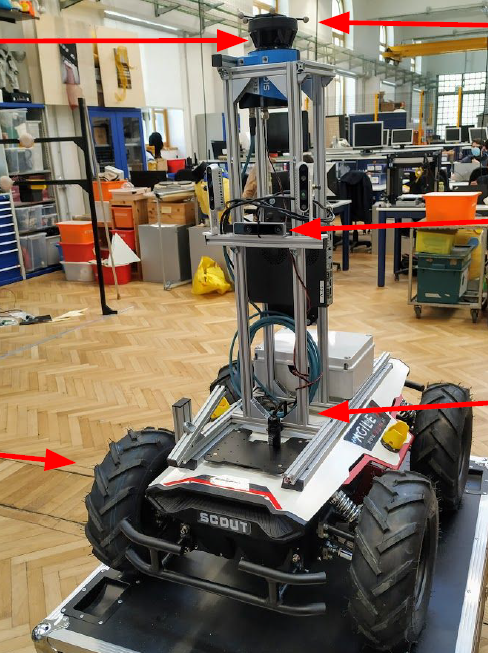

# ROS ~ Robotics course's second assignment
Politecnico di Milano - Accademic Year 2020-2021

The whole project was implemented utilizing `ROS Melodic` on a `Linux Ubuntu 18.04` machine.

## Goals

- Use calibration bag to estimate the rotation between odometry and laser reference frames
- Create a map using directly the odometry or with the output of robot localization (using `gmapping`)
- Perform localization with `amcl` + `robot localization`
  - Use the best sensor setup to achieve accurate localization (min two sources in robot localization)
  - You can use imu_tools to preprocess imu data (not mandatory)

##

> To see the complete requirements -> [Project presentation](Project2_description.pdf)

> To see the complete description of the package -> [Report](report.txt)

(Grade: 100%)

## Team
* [__Alessandro Barbiero__](https://github.com/AlessandroBarbiero)
* [__Andrea Borsatto__](https://github.com/AndreaBorsatto)
* [__Amir Bachir__](https://github.com/AmirBachir)
